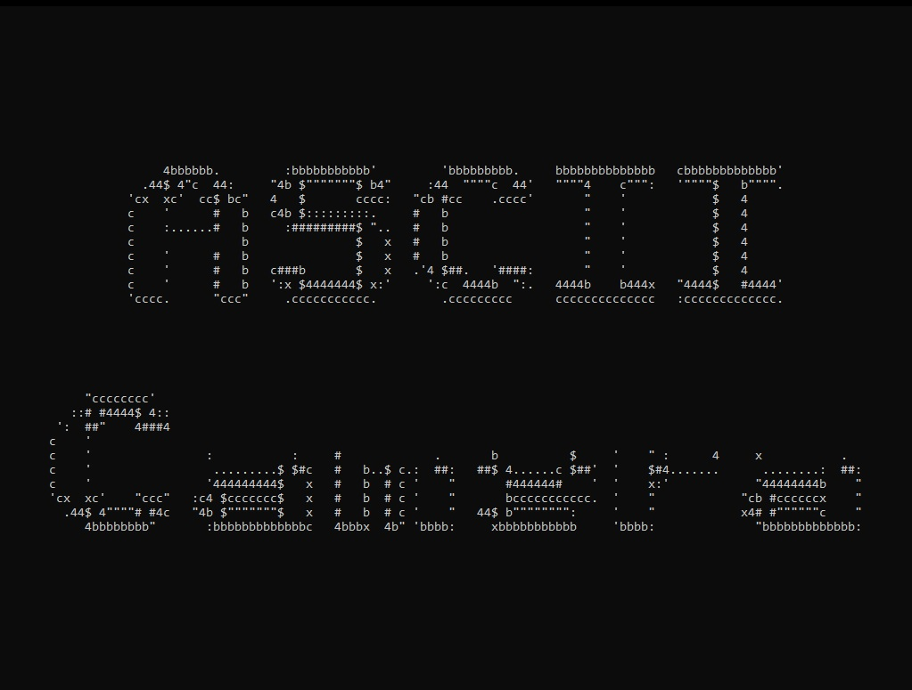

# ASCII-Camera

This project is a console application that render the camera stream into ASCII art.
## Features
- The ASCII camera
## Installation
1. Download the repository by clicking on `Code > Download ZIP`
2. Extract the ZIP file
3. Run `main.exe`